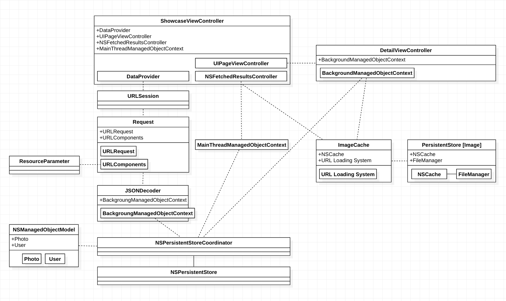

# CodingChallenge-500px
The objective of this coding challenge is to create a simple photo-browsing app using [500px's APIs](https://github.com/500px/legacy-api-documentation). The deliverable should fulfill a minimal set of requirements as outlined below:
* __Photo Showcase__
  
  The app should showcase Popular photos from 500px dynamically obtained from the 500px API. 
  Futhermore, the showcase should allow app users to browse through multiple pages of content.
  
* __Photo Details__

  When a user clicks on showcased photo, a full screen version of the photo should be displayed along with detailed information about the photo.

The engineering team at 500px works with [IGListKit](https://github.com/Instagram/IGListKit), [RocketData](https://github.com/plivesey/RocketData) and [Alamofire](https://github.com/Alamofire/Alamofire) on a day-to-day basis to deliver performant & reliable products. My attempt at this challenge will be to recreate a simplified version of [500px](https://apps.apple.com/app/500px/id471965292) using their native counterparts - [UICollectionView](https://developer.apple.com/documentation/uikit/uicollectionview), [CoreData](https://developer.apple.com/documentation/coredata), and [URLSession](https://developer.apple.com/documentation/foundation/urlsession).

## The Demo

## TODO
* __Justified Layout - Showcasing Photos with Preserved Aspect Ratios__

   A classic approach to justifying layout of a photo grid to display photos in their aspect ratios finds its roots in the [Text Justification](https://en.wikipedia.org/wiki/Line_wrap_and_word_wrap) problem. The idea is to have photo dimensions resized to fit fixed row heights while preserving aspect ratios. Photo failing to stack to the end of the row is moved to the next row. 
   
   The drawback with this approach is that it introduces either uneven inter-item spacings or inconsistent margins at the end of each row, depending on the fitting policy. With somewhat flexible row heights, inter-item spacing can be strictly enforced to give a more consistent look. 
   
   500px's own [Greedo Layout](https://github.com/500px/greedo-layout-for-ios) is an elegant take on the idea. Nevertheless, the tough grind with justified layout implementations is adapting to device orientation transitions.

## Instruction
Create file "consumer_key.txt" with 500px's consumer key in the Xcode project.

## Design

### Data Source

__Fetching Remote Data__

[Request](./CodingChallenge-500px/Networking/Request.swift) is a lightweight web service client - a simple wrapper around [URLRequest](https://developer.apple.com/documentation/foundation/urlrequest) & [URLComponents](https://developer.apple.com/documentation/foundation/urlcomponents) coupled with its own builder designed to fullfil a subset of 500px's HTTP GET requests. It supports query parameter injection through the [ResourceParameter](./CodingChallenge-500px/Networking/ResourceParameter/ResourceParameter%2BPhotos.swift) abstraction.

__Handling Fetched Data__

Response from the request are de-serialized into CoreData entities using [JSONDecoder](https://developer.apple.com/documentation/foundation/jsondecoder). Data models are managed objects subclasses conforming to the [Decodable](https://developer.apple.com/documentation/swift/decodable) protocol. The id property is used as the unique key in the managed object model to identify duplicated [Photo](./CodingChallenge-500px/CoreData/DataModels/Photo%2BCoreDataClass.swift)/[User](CodingChallenge-500px/CoreData/DataModels/User%2BCoreDataClass.swift) entities.  Entities are created and inserted into the background managed object context. 
