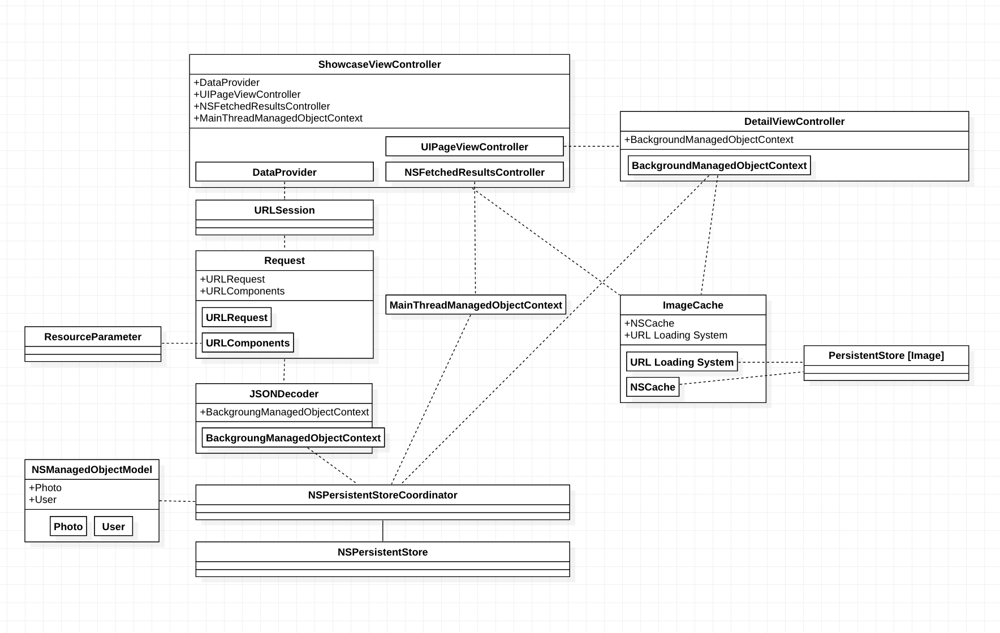

# CodingChallenge-500px
The objective of this coding challenge is to create a simple photo-browsing app using [500px's APIs](https://github.com/500px/legacy-api-documentation). The deliverable should fulfill a minimal set of requirements as outlined below:
* __Photo Showcase__
  
  The app should showcase Popular photos from 500px dynamically obtained from the 500px API. 
  Futhermore, the showcase should allow app users to browse through multiple pages of content.
  
* __Photo Details__

  When a user clicks on showcased photo, a full screen version of the photo should be displayed along with detailed information about the photo.

The engineering team at 500px works with [IGListKit](https://github.com/Instagram/IGListKit), [RocketData](https://github.com/plivesey/RocketData) and [Alamofire](https://github.com/Alamofire/Alamofire) on a day-to-day basis to deliver performant & reliable products. My attempt at this challenge will be to recreate a simplified version of [500px](https://apps.apple.com/app/500px/id471965292) using their native counterparts - [UICollectionView](https://developer.apple.com/documentation/uikit/uicollectionview), [CoreData](https://developer.apple.com/documentation/coredata), and [URLSession](https://developer.apple.com/documentation/foundation/urlsession).

## The Demo

## Instruction
* Create file "consumer_key.txt" containing 500px's consumer key in the Xcode project.

## Design

